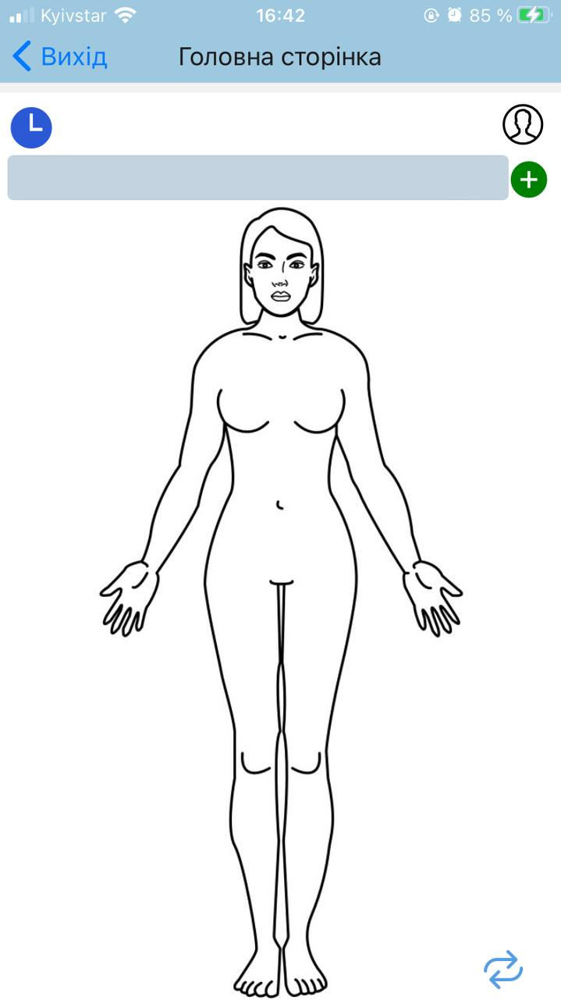
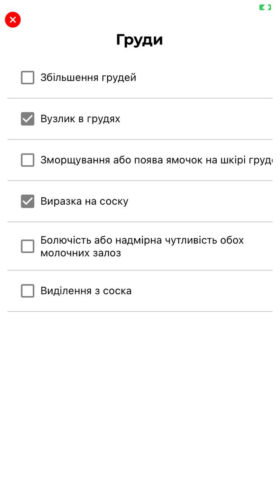
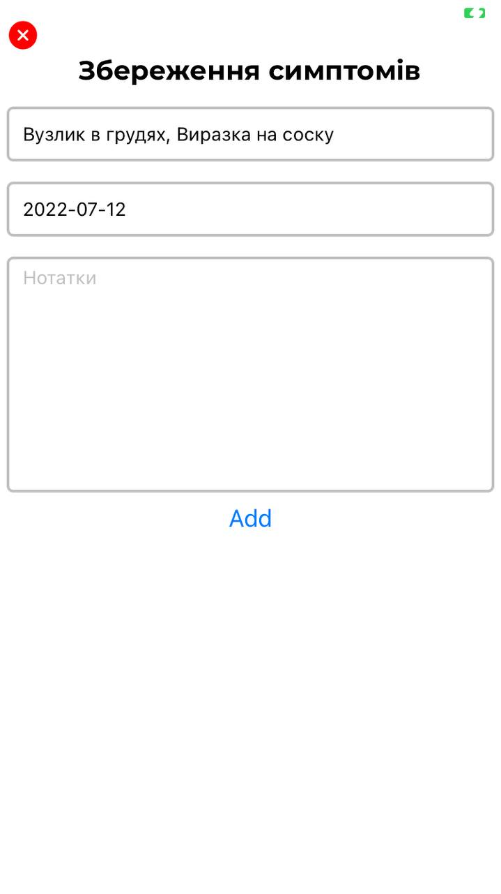
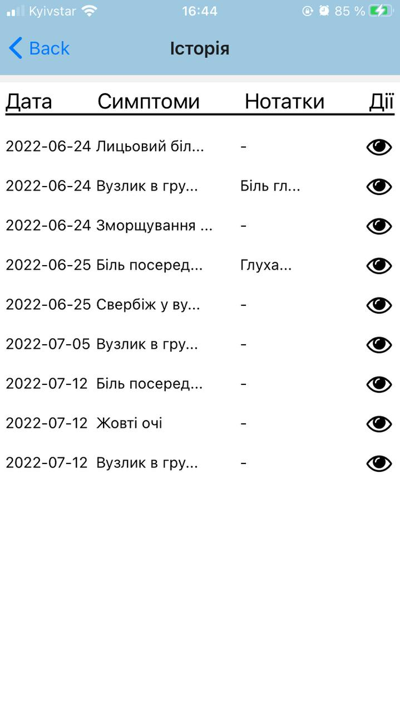
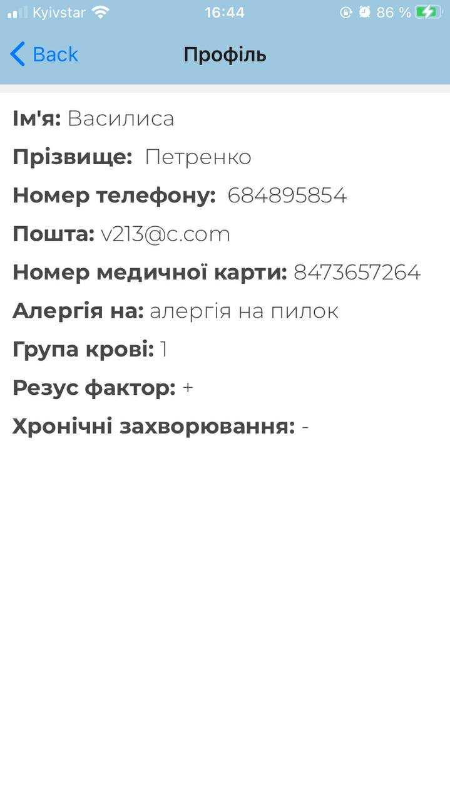

# Symptoms App
## About project
Symptoms App is part of a system "Electronic medicine card", that consisting of cross-platform [web](https://github.com/MrGold6/medcart) and mobile applications.
It's additional project that helps doctor make a diagnosis more correctly due to more data about patient (symptoms chronology).

Patient can get symptoms by body part, chose and save them. As a result we have chronology of symptoms.
Patient can look chronology at mobile or web apps. 

Server is REST API projects on Spring Boot and client on React Native.

## Diagrams:
* [UseCase](https://drive.google.com/file/d/1e3DO7SRFuwvvlDVfuzJKhg1SVcHHkm4L/view?usp=sharing)
* [State Chart](https://drive.google.com/file/d/1IzRqSl2xvJFCWvh7ohSeZ1yq3Zhmc5Ud/view?usp=sharing)
* [Database](https://drive.google.com/file/d/1f7f6KTtPT7f_X6OTF2PZFO4N0OGbzIKm/view?usp=sharing)
* [Deployment](https://drive.google.com/file/d/1-qLb4mB_VwrxrVzBBMXO4aBFuOvqKfGM/view?usp=sharing)

## Screenshots:

#### Main window where you can choose part of body: 
#### List of symptoms by body part: 
#### Save symptoms: 
#### Symptoms chronology: 
#### Full record information : 
#### Profile info: 
